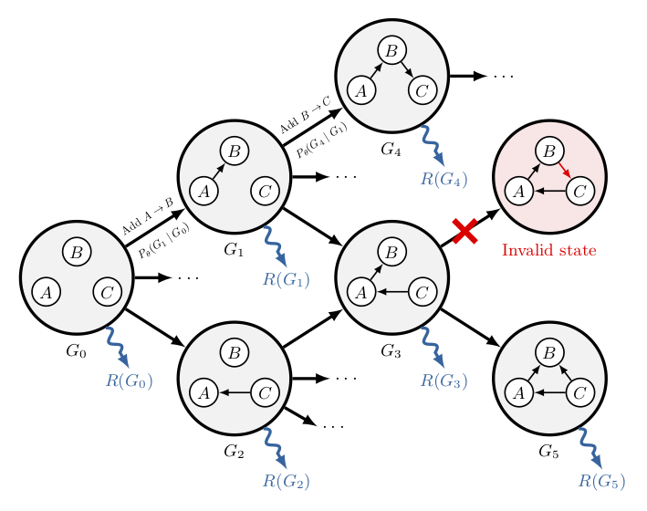

# DAG-GFlowNet

[Paper](https://arxiv.org/abs/2202.13903) - [Installation](#installation) - [Example](#example) - [Citation](#citation)

This repository contains the official implementation in [JAX](https://github.com/google/jax) of DAG-GFlowNet ([Deleu et al., 2022](https://arxiv.org/abs/2202.13903)), a Bayesian structure learning algorithm based on Generative Flow Networks (GFlowNets; [Bengio et al., 2021](http://folinoid.com/w/gflownet/)). This contains the environment to sample sequentially a graph one edge at a time, written as a [Gym](https://github.com/openai/gym) environment.

> Tristan Deleu, António Góis, Chris Emezue, Mansi Rankawat, Simon Lacoste-Julien, Stefan Bauer, Yoshua Bengio, *Bayesian Structure Learning with Generative Flow Networks*, 2022

## Installation
To avoid any conflict with your existing Python setup, we suggest to work in a virtual environment:
```bash
python -m venv venv
source venv/bin/activate
```
Follow these [instructions](https://github.com/google/jax#installation) to install the version of JAX corresponding to your versions of CUDA and CuDNN.
```bash
git clone https://github.com/tristandeleu/jax-dag-gflownet.git
cd jax-dag-gflownet
pip install -r requirements.txt
```

## Example
You can train DAG-GFlowNet on a randomly generated dataset of 100 observations from an Erdos-Renyi graph over 5 nodes using the following command:
```bash
python train.py --batch_size 256 erdos_renyi_lingauss --num_variables 5 --num_edges 5 --num_samples 100
```

## Citation
If you want to cite DAG-GFlowNet, use the following Bibtex entry:
```
@article{deleu2022daggflownet,
    title={{Bayesian Structure Learning with Generative Flow Networks}},
    author={Deleu, Tristan and G{\'o}is, Ant{\'o}nio and Emezue, Chris and Rankawat, Mansi and Lacoste-Julien, Simon and Bauer, Stefan and Bengio, Yoshua},
    journal={arXiv preprint},
    year={2022}
}
```